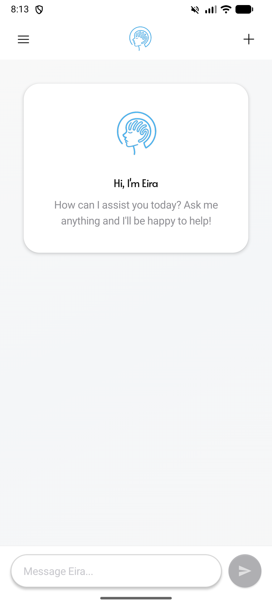
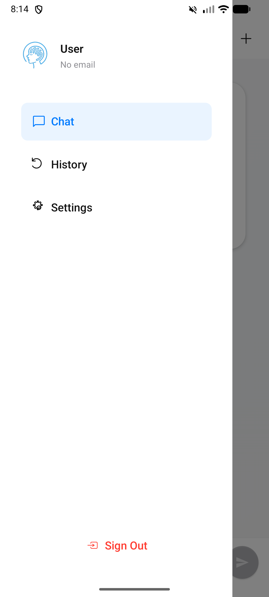
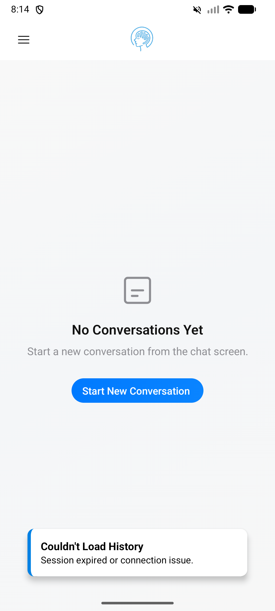
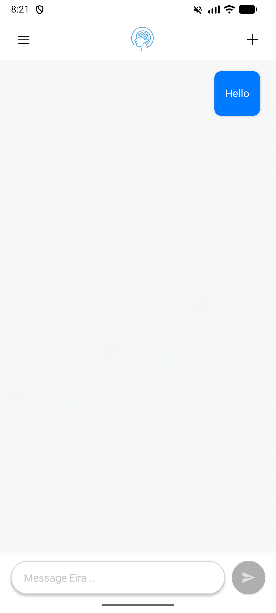

# Eira — Mental Well-being AI Companion

A mobile app for mental wellness support, powered by Google Gemini AI. Built with React Native (Expo) on the frontend and a hardened Express.js + MongoDB backend.

## Screenshots

| Login | Chat | Drawer | History |
|-------|------|--------|---------|
|  |  |  |  |

| Chat with message |
|-------------------|
|  |

## Features

- **Context-aware conversations** — Eira remembers chat history within a session
- **Secure authentication** — JWT with HS256 algorithm pinning, bcrypt password hashing
- **AI via backend proxy** — Gemini API key never leaves the server; all AI calls are authenticated
- **Dark / light mode** — Persisted theme preference
- **Chat history** — Browse and resume past conversations
- **Markdown rendering** — AI responses render with code blocks, lists, bold, etc.

## Tech Stack

| Layer | Technology |
|-------|-----------|
| Mobile | React Native 0.81, Expo SDK 54, TypeScript |
| Navigation | React Navigation v7 (Drawer + Stack) |
| Animations | react-native-reanimated 4.1.1, react-native-worklets 0.5.1 |
| Backend | Node.js, Express.js, MongoDB (Atlas) |
| AI | Google Gemini (via `@google/generative-ai` on backend only) |
| Auth | JWT (jsonwebtoken), bcryptjs |
| Testing | Jest + Supertest (37 backend tests) |

## Project Structure

```
Eira/
├── backend/
│   ├── config/db.js          # MongoDB connection (promise singleton)
│   ├── middleware/auth.js     # JWT verification with algorithm pinning
│   ├── routes/userRoutes.js  # All API routes (auth + chat + AI proxy)
│   ├── server.js             # Express app + graceful shutdown
│   ├── tests/                # 37 backend tests (TDD)
│   ├── .env.example
│   └── package.json
└── frontend/
    ├── screens/              # LoginScreen, HomeScreen, HistoryScreen, SettingsScreen
    ├── components/chat/      # ChatBubble, MessageInputBar, ChatHeader
    ├── hooks/useChatLogic.ts # All chat state logic
    ├── contexts/ThemeContext  # Dark/light mode
    ├── app.config.js
    ├── .env.example
    └── package.json
```

## Setup

### Prerequisites

- Node.js 18+
- Android Studio (with an AVD) or physical Android device
- MongoDB Atlas account (or local MongoDB)
- Google Gemini API key — get one free at [Google AI Studio](https://aistudio.google.com)

### 1. Clone & install

```bash
git clone https://github.com/ghtmarco/Eira.git
cd Eira
```

### 2. Backend

```bash
cd backend
npm install
cp .env.example .env
```

Edit `backend/.env`:

```env
PORT=5000
MONGO_URI=mongodb+srv://<user>:<password>@cluster.mongodb.net/eira
JWT_SECRET=<random-64-char-hex>
GEMINI_API_KEY=<your-gemini-api-key>
ALLOWED_ORIGINS=http://localhost:19006,exp://192.168.x.x:8081
NODE_ENV=development
```

```bash
npm run dev   # starts with nodemon on port 5000
```

### 3. Frontend

```bash
cd frontend
npm install
cp .env.example .env
```

Edit `frontend/.env`:

```env
# Android emulator → 10.0.2.2 | Physical device → your machine's LAN IP
SERVER_URL=http://10.0.2.2:5000/api
PHONE_NUMBER=628123456789
```

```bash
npx expo start
# Press 'a' to open on Android emulator
```

### Connecting emulator to backend

| Device | SERVER_URL |
|--------|-----------|
| Android emulator | `http://10.0.2.2:5000/api` |
| Physical device (USB/WiFi) | `http://192.168.x.x:5000/api` |
| iOS simulator | `http://localhost:5000/api` |

## Running Tests

```bash
cd backend
npm test
```

37 tests cover:
- Registration, login, password change
- JWT algorithm pinning (rejects `alg:none` tokens)
- ObjectId validation (returns 400, not 500, for garbage IDs)
- Chat CRUD with ownership enforcement (403 for wrong user)
- AI proxy endpoint (401/403/400/503 edge cases)
- Error message leakage prevention

## API Reference

All routes are prefixed `/api/users`.

| Method | Path | Auth | Description |
|--------|------|------|-------------|
| POST | `/register` | Public | Create account |
| POST | `/login` | Public | Get JWT token |
| POST | `/change-password` | Bearer | Change password (requires current password) |
| POST | `/chat/ai` | Bearer | Send message to Gemini AI |
| POST | `/chats` | Bearer | Create or update a chat |
| GET | `/chats/user/:userId` | Bearer | List all chats for a user |
| GET | `/chats/:chatId` | Bearer | Get a single chat |
| DELETE | `/chats/:chatId` | Bearer | Delete a chat |

## Security Highlights

- **JWT algorithm pinning** — `algorithms: ['HS256']` prevents algorithm confusion attacks
- **API key in backend only** — Gemini key is never bundled in the mobile app
- **ObjectId validation** — All MongoDB ID params validated before query
- **Body size limit** — 100kb max request body
- **Ownership checks** — Users can only read/write their own chats
- **No error leakage** — Internal errors never expose `error.message` to clients
- **ReDoS protection** — Email lookup uses exact match, not regex

## Troubleshooting

**Red screen: `installTurboModule` TurboModule error**
This happens when `react-native-worklets` JS version doesn't match Expo Go's compiled binary. Make sure your installed versions match Expo SDK 54's bundled versions:
```bash
npm install react-native-reanimated@4.1.1 react-native-worklets@0.5.1 --save-exact --legacy-peer-deps
```

**Cannot connect to backend from emulator**
Use `10.0.2.2` (not `localhost`) in `SERVER_URL` — Android emulator routes `10.0.2.2` to the host machine.

**AI returns "technical difficulties" message**
Add `GEMINI_API_KEY` to `backend/.env` and restart the backend.

**Port 5000 in use**
```powershell
# Windows
(Get-NetTCPConnection -LocalPort 5000).OwningProcess | ForEach-Object { Stop-Process -Id $_ -Force }
```

**Expo starts on port 8081 but emulator won't connect**
Try opening the URL manually:
```bash
adb shell am start -a android.intent.action.VIEW -d "exp://10.0.2.2:8081"
```

## License

MIT
